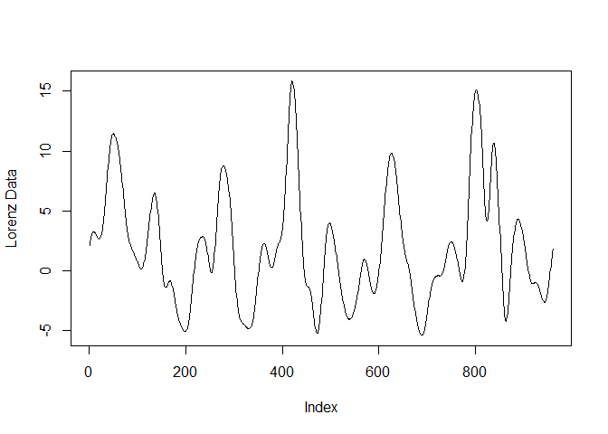
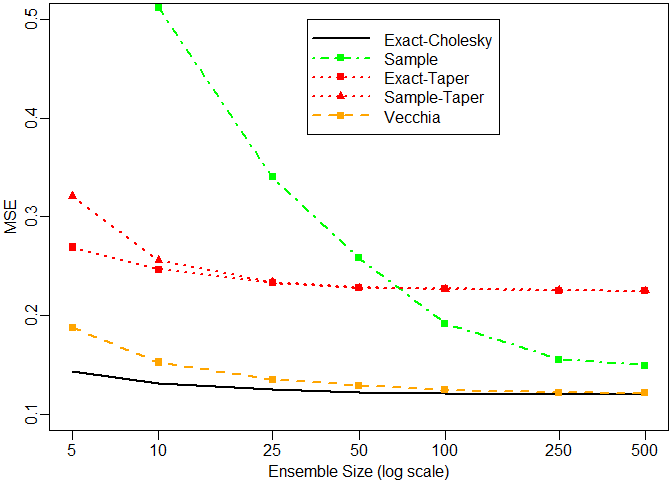

VEnKF Introduction
------------------

- [Brief Description](#Brief_Description)
  * [EnKF Updates](#EnKF_Updates)
  * [VEcchia Update](#Vecchia_Update)
  * [Lorenz Model](#Lorenz_Model)
- [Examples and Simulations](#Examples_and_Simulations)
- [References](#References)

    library(VEnKF)

Brief Description
-----------------

This package is built to provide functionality to the method described
in my forthcoming paper with Dr. Matthias Katzfuss. The main purpose of
the package is the function vec.update, which calculates the update step
in an Ensemble Kalman Filter using Vecchia approximation to regularize
the covariance estimation.

Another purpose of this package is the other update functions for
Ensemble Kalman Filters. These are functions that provide basic update
steps to implement with other regularization methods for comparison
against our method as well as new methods in the future.

The final purpose of this package is the implementation of a Lorenz
chaos model for testing methods of data assimilation. The model is
described in Lorenz (2005) as Model II.

### EnKF Updates

The Ensemble Kalman Filter is common algorithm utilized in large data
assimilation applications based upon the state-space model where we have
a sample from a distribution
$\\hat{\\mathbf{x}}\_{t-1}^{(1)},\\dots,\\hat{\\mathbf{x}}\_{t-1}^{(N)}$.
The state-space model is typically broken up into two steps: an
Observation Model and an Evolution Model.

**y***t* = **H***t***x***t* + **v***t*,   **v***t* ∼ *N**m**t*(0, **R***t*)

**x***t* = **M***t***x***t* − 1 + **w***t*,   **w***t* ∼ *N**n*(0, **Q***t*)

This model can also be thought of as a forecast step and an update step.
In most applications, the forecast step is considered a “black box”
algorithm for some process, so we do not have knowledge of the internal
mechanism and cannot with consistency improve upon the class of Ensemble
Kalman Filters by working on these “black box” forecast steps. Instead
we focus upon the update step:

**x***i*\* = *g*(**x***i*|*Σ*) = *Σ*\*(*Σ* − 1**x***i* + **H**′**R** − 1**y***i*)

where

*Σ*\* = (*Σ* − 1 + **H**′**R** − 1**H**) − 1

This provides the framework for various regularized update steps
including tapering and localization on the estimated covariance matrix.
It is also possible, but not recommended for large datasets, to utilize
the unregularized sample covariance matrix.

This method is implemented in the functions simple.update and
tap.update()\`.

### Vecchia Update

The Vecchia update step breaks down the equation for the update step
with a modified Cholesky decomposition:

*g*(**x***i*) = **K***i* − 1(**K***i*′) − 1(**L***i*′**L***i***x***i* + **H**′**R** − 1**y***i*)

where

$$\\mathbf{L}\_i=\\mathbf{D}\_i^{-\\frac{1}{2}}\\mathbf{U}\_i'$$

and

**K***i* = *C**h**o**l*(**L***i*′**L***i* + **H**′**R** − 1**H**).

As described in the forthcoming paper, D is drawn from an Inverse Gamma,
and U is drawn from a Normal. Both have hyperparameters represented by
theta which is determined using maximum a posteriori methods. These
hyperparameters can also be used to determine the number of nearest
neighbors, m.

The chol.update function provides the modified update step, and the
vec.update function provides the full Vecchia method.

### Lorenz Model

The Lorenz functions are modelled after the second model from Lorenz
(2005).

Below is a graph of a single iteration from a Lorenz model with N = 960,
F = 10, K = 32, dt = 0.005, and M = 40.

Examples and Simulations
------------------------

Below is code that runs a simple simulation of the update functions and
plots the Mean Squared Errors against the log-scaled ensemble sizes

    n = 10
    Ns = c(5, 10, 25, 50, 100, 250, 500)
    reps = 8
    range = 0.4
    taus = c(0.1, 0.4, 1)
    tau = taus[2]

    tapers = c(0.2, 0.5, 1)

    set.seed(2785)
    S = seq(0, 1, length = n)
    S2d = expand.grid(S, S)
    ords = orderMaxMinFast(S2d, numpropose = n^2)
    S2d.ord = S2d[ords, ]
    dist.mat = rdist(S2d.ord)
    sigma.mat = exp(-dist.mat/range[i])
    sigma.mat.inv = solve(sigma.mat)

    mu.vect = rep.int(0, n^2)
    H.mat = diag(nrow = n^2, ncol = n^2, names = F)
    tau.mat = diag(tau, nrow = n^2, ncol = n^2, names = F)
    tau.mat.inv = solve(tau.mat)

    MSE.mat = matrix(0, length(Ns), 5)

    nworkers <- detectCores()
    nworkers

    cl <- makeCluster(nworkers)
    registerDoParallel(cl)

    writeLines(c(""), "log.txt")

    Cov.array.list = foreach(rep = 1:reps, .packages = c("mvnfast", "scoringRules", 
        "fields", "MASS", "GpGp", "Matrix")) %dorng% {
        sink("log.txt", append = TRUE)
        cat(paste("Starting iteration", rep, "\n"))
        
        # Generate Data
        x0 = as.vector(rmvn(1, mu.vect, sigma.mat))
        y = as.vector(rmvn(1, H.mat %*% x0, tau.mat))
        
        # True Posterior mu and Sigma
        post.sigma.mat.true = solve(sigma.mat.inv + tau.mat.inv)
        post.mu.vect.true = as.vector(post.sigma.mat.true %*% (sigma.mat.inv %*% 
            as.matrix(mu.vect) + t(H.mat) %*% tau.mat.inv %*% y))
        
        
        for (i in 1:length(Ns)) {
            
            N = Ns[i]
            
            # sample from prior
            
            x.mult.prior = t(rmvn(N, mu.vect, sigma.mat))
            y.mult.i = t(rmvn(N, y, tau.mat))
            
            # Tapered sample estimate of covariance matrix
            taper.samp.est.cov = cov(t(x.mult.prior)) * taper
            
            
            
            # EnKF update with sample covariance matrix
            x.mult.post.hat = simple.update(x.mult.prior, y.mult.i, cov(t(x.mult.prior)), 
                H.mat, tau.mat)
            hat.mu = rowMeans(x.mult.post.hat)
            
            # EnKF update from true posterior cholesky
            x.mult.post.chol = chol.update(x.mult.prior, y.mult.i, chol.mat, 
                H.mat, tau.mat)
            chol.mu = rowMeans(x.mult.post.chol)
            
            # Tapering True Prior EnKF update
            x.mult.post.taper = simple.update(x.mult.prior, y.mult.i, taper.sigma.mat, 
                H.mat, tau.mat)
            taper.mu = rowMeans(x.mult.post.taper)
            
            # Tapering Estimated Prior EnKF update
            x.mult.post.tap.hat = simple.update(x.mult.prior, y.mult.i, taper.samp.est.cov, 
                H.mat, tau.mat)
            tap.hat.mu = rowMeans(x.mult.post.tap.hat)
            
            # Vecchia Prior EnKF update
            x.mult.post.vec = vec.update(x.mult.prior, y.mult.i, H.mat, tau.mat, 
                S = S2d.ord)
            vec.mu = rowMeans(x.mult.post.vec$update)
            
            MSE.mat[i, 1] = sum((chol.mu - x0)^2)/length(x0)
            MSE.mat[i, 2] = sum((hat.mu - x0)^2)/length(x0)
            MSE.mat[i, 3] = sum((taper.mu - x0)^2)/length(x0)
            MSE.mat[i, 4] = sum((tap.hat.mu - x0)^2)/length(x0)
            MSE.mat[i, 5] = sum((vec.mu - x0)^2)/length(x0)
            
        }
        MSE.mat
    }

    stopCluster(cl)

References
----------

Lorenz, Edward N. 2005. “Designing chaotic models.” *Journal of the
Atmospheric Sciences* 62 (5): 1574–87.
<https://doi.org/10.1175/JAS3430.1>.
